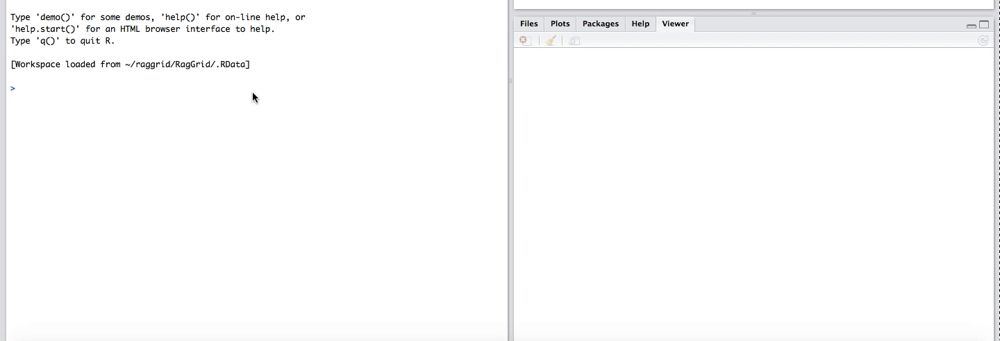

# R ag-Grid

[](https://travis-ci.com/no-types/RagGrid)
[](http://www.repostatus.org/#wip)
[](https://coveralls.io/github/no-types/RagGrid)

R interface to ag-grid.

This package provides a function `aggrid()` to display R data via the [ag-grid](https://www.ag-grid.com/) library.

## Installation

We're still actively developing and hopefully it'll be available in CRAN soon. 

But feel free to install from github.
You may install the development version using **devtools**:

```r

# the development version
devtools::install_github('no-types/RagGrid')

# then try RagGrid::aggrid(iris) as a hello world example
```


### Basic Usage
1. [ag-Grid Table Options](tutorial/basic-configuration.md)
2. [Table Formatting Options](tutorial/table-formatting.md)
3. [Integration with Shiny](tutorial/shiny.md)
4. [Cross Talk Demo](tutorial/cross-talk-demo.md)